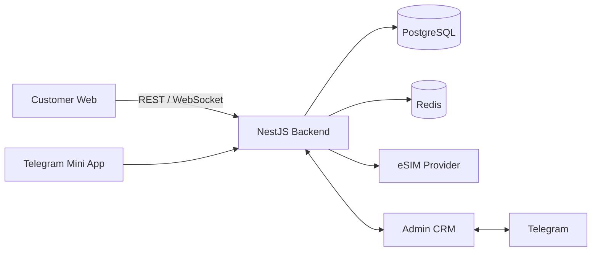

<!-- Header banner -->

 

 

**🟢 Open to work: Backend / Full-Stack · Remote or Hybrid**

---

## About

5+ years of building and shipping products end-to-end: architecture, development, integrations, testing, deployment and production support.

<table>
  <tr>
    <td width="50%" valign="top">

**Architecture** 
Scalable Node.js / NestJS systems, microservices (RabbitMQ, TCP RPC)

**Real-time** 
WebSocket, Socket.IO, Server-Sent Events

**Payments** 
Stripe, crypto, TON, Web3

  </td>
  <td width="50%" valign="top">

**Security** 
JWT, OAuth, 2FA, RBAC

**Telegram & AI** 
Bots, Mini Apps, AI-powered features

**Integrations** 
Third-party APIs, providers, payment systems

  </td>
  </tr>
</table>

---

## Tech Stack

---

## Featured Projects

### CozzySIM: Production eSIM Platform

*Built under Rcozzy* · **[Live: cozzysim.com](https://cozzysim.com/)**

A platform for buying and managing international mobile connectivity: web app, Telegram Mini App, backend, admin CRM and real-time customer support.

  
  

- eSIM catalog covering 200+ countries, instant purchase and QR-code activation
- eSIM provider API integration, payments, balance and wallet
- Real-time support: Customer Web ↔ Backend ↔ Admin CRM ↔ Telegram
- AI-generated country content, multilingual UI, dark / light themes

<!-- TODO: add a result, e.g. number of users / orders / countries -->

`NestJS` `PostgreSQL` `Redis` `Next.js` `Socket.IO` `Telegram Mini Apps` `Docker` `Nginx`

<b>Architecture diagram</b>

 

<table>
  <tr>
    <td width="50%" valign="top">

#### Homeberries
**Multi-tenant e-commerce SaaS**

Marketplace where each company gets its own isolated storefront.

- Multi-tenant architecture
- Stripe and crypto (Bitcoin / Web3)
- 3D product views, Google Maps delivery

`NestJS` `Next.js` `PostgreSQL` `RabbitMQ` `Stripe`

  </td>
  <td width="50%" valign="top">

#### Ararat Family Meat Co.
**B2B order management**

Replaced spreadsheets and paper workflows for a wholesale food distributor.

- Weight-based invoicing, per-client pricing
- Payment tracking, automated PDF generation

`Next.js` `NestJS` `PostgreSQL` `Sequelize` `Docker`

  </td>
  </tr>
  <tr>
    <td colspan="2" valign="top">

#### Order
**Offline-first warehouse & delivery app**

Mobile-first app for environments with unreliable internet: offline order queueing, automatic sync, price snapshots, revenue and profit analytics.

`React 19` `TypeScript` `Vite` `TanStack Query` `Zustand`

  </td>
  </tr>
</table>

---

**Building a product that needs a reliable backend, solid architecture or complex integrations?**

[Write on Telegram](https://t.me/tigmandev) · [Send an email](mailto:tigran.manukyan.2002@gmail.com)

